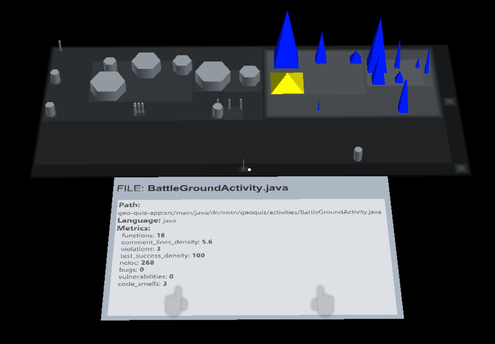

# SoftwareCity

Die Firma [QAware](http://www.qaware.de/) führt im Auftrag ihrer Kunden Softwaremodulanalysen durch. Dabei werden Standard Tools (SonarQube) mit Eigenentwicklungen kombiniert. Diese Analysen produzieren viele Metriken, welche Aussagen über den Code und das Projekt machen. Bei Diskussionen und der Analyse ist es hilfreich, Softwareprojekte besser „greifbar" zu machen. Ein Ansatz Software in die dreidimensionale Welt zu bringen, sind Softwarestädte. Sie visualisieren die Struktur, sowie weitere ausgewählte Softwareeigenschaften über die Analogie einer Stadt. Motivation für dieses Projekt sind der dadurch gewonnen bessere Überblick und die bessere Diskussionsgrundlage.

Unsere Aufgabe bestand darin ein Tool zu entwickeln, um eine solche Softwarestadt auf Basis von Metriken und Projektstruktur zugenerieren. Zum Visualisieren kommt die Microsoft Hololens zum Einsatz. Die Daten werden von der Hololens aus der SonarQube Web API ausgelesen, aufbereitet und dargestellt. Die Hololens ermöglicht die Stadt wie ein Hologramm darzustellen und damit zu interagieren. Es ist möglich Gebäude für mehr kontextuelle Infos anzuklicken.

